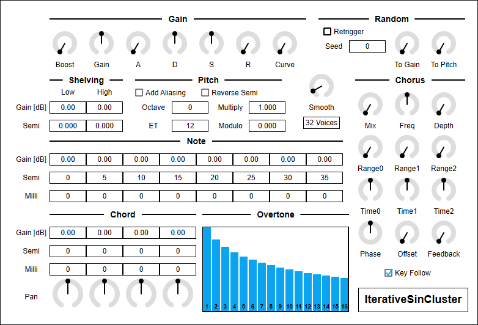

---
lang: ja
...

# IterativeSinCluster


<ruby>IterativeSinCluster<rt>イテレイティブ サイン クラスタ</rt></ruby>はノート 1 つあたり 512 のサイン波を計算する加算合成シンセサイザです。一体、何を考えていたのか iterative sin という言葉を名前に使っていますが、アルゴリズムの種類を表す正しい言葉は recursive sine です。

- [IterativeSinCluster 0.1.9 をダウンロード - VST® 3 (github.com)](https://github.com/ryukau/VSTPlugins/releases/download/L4Reverb0.1.0/IterativeSinCluster0.1.9.zip) 
- [プリセットをダウンロード (github.com)](https://github.com/ryukau/VSTPlugins/releases/download/EnvelopedSine0.1.0/IterativeSinClusterPresets.zip)

IterativeSinCluster を使うには CPU が AVX 以降の SIMD 命令セットをサポートしている必要があります。

パッケージには次のビルドが含まれています。

- Windows 64bit
- Linux 64bit
- macOS 64bit

Mac を持っていないので、 macOS ビルドはテストできていません。もしバグを見つけたときは [GitHub のリポジトリ](https://github.com/ryukau/VSTPlugins)に issue を作るか、 `ryukau@gmail.com` までメールを送っていただければ対応します。

Linux ビルドは Ubuntu 18.0.4 でビルドしています。また Bitwig 3.1.2 と REAPER 6.03 で動作確認を行いました。 Bitwig 3.1.2 では GUI が真っ黒になるバグがあるようです。

## インストール
### プラグイン
名前が `.vst3` で終わるディレクトリを OS ごとに決められた位置に配置してください。

- Windows では `/Program Files/Common Files/VST3/` に配置します。
- Linux では `$HOME/.vst3/` に配置します。
- macOS では `/Users/$USERNAME/Library/Audio/Plug-ins/VST3/` に配置します。

DAW によっては上記とは別に VST3 をインストールできるディレクトリを提供していることがあります。詳しくは利用している DAW のマニュアルを参照してください。

### プリセット
解凍して出てきたディレクトリを OS ごとに決められた位置に配置すると使えるようになります。

- Windows : `/Users/$USERNAME/Documents/VST3 Presets/Uhhyou`
- Linux : `$HOME/.vst3/presets/Uhhyou`
- macOS : `/Users/$USERNAME/Library/Audio/Presets/Uhhyou`

プリセットディレクトリの名前はプラグインと同じである必要があります。 `Uhhyou` ディレクトリが無いときは作成してください。

### Windows
プラグインが DAW に認識されないときは C++ redistributable をインストールしてみてください。インストーラは次のリンクからダウンロードできます。ファイル名は `vc_redist.x64.exe` です。

- [The latest supported Visual C++ downloads](https://support.microsoft.com/en-us/help/2977003/the-latest-supported-visual-c-downloads)

### Linux
Ubuntu 18.0.4 では次のパッケージのインストールが必要です。

```bash
sudo apt install libxcb-cursor0  libxkbcommon-x11-0
```

もし DAW がプラグインを認識しないときは、下のリンクの `Package Requirements` を参考にして VST3 に必要なパッケージがすべてインストールされているか確認してみてください。

- [VST 3 Interfaces: Setup Linux for building VST 3 Plug-ins](https://steinbergmedia.github.io/vst3_doc/vstinterfaces/linuxSetup.html)

REAPER の Linux 版がプラグインを認識しないときは `~/.config/REAPER/reaper-vstplugins64.ini` を削除して REAPER を再起動してみてください。

## 色の設定
初回設定時は手動で次のファイルを作成してください。

- Windows では `/Users/ユーザ名/AppData/Roaming/UhhyouPlugins/style/style.json` 。
- Linux では `$XDG_CONFIG_HOME/UhhyouPlugins/style/style.json` 。
  - `$XDG_CONFIG_HOME` が空のときは `$HOME/.config/UhhyouPlugins/style/style.json` 。
- macOS では `/Users/$USERNAME/Library/Preferences/UhhyouPlugins/style/style.json` 。

既存の色のテーマを次のリンクに掲載しています。 `style.json` にコピペして使ってください。

- [LV2Plugins/style/themes at master · ryukau/LV2Plugins · GitHub](https://github.com/ryukau/LV2Plugins/tree/master/style/themes)

`style.json` の設定例です。

```json
{
  "foreground": "#ffffff",
  "foregroundButtonOn": "#000000",
  "background": "#353d3e",
  "boxBackground": "#000000",
  "border": "#808080",
  "unfocused": "#b8a65c",
  "highlightMain": "#368a94",
  "highlightAccent": "#2c8a58",
  "highlightButton": "#a77842",
  "highlightWarning": "#8742a7",
  "overlay": "#ffffff88",
  "overlayHighlight": "#00ff0033"
}
```

16 進数カラーコードを使っています。

- 6 桁の色は RGB 。
- 8 桁の色は RGBA 。

プラグインはカラーコードの 1 文字目を無視します。よって `?102938` や `\n11335577` も有効なカラーコードです。

2 文字目以降のカラーコードの値に `0-9a-f` 以外の文字を使わないでください。

以下は設定できる色の一覧です。設定に抜けがあるとデフォルトの色が使われます。

- `foreground`: 文字の色。
- `foregroundButtonOn`: オンになっているボタンの文字の色。 `foreground` か `boxBackground` のいずれかと同じ値にすることを推奨します。
- `background`: 背景色。
- `boxBackground`: 矩形の UI 部品の内側の背景色。
- `border`: <ruby>縁<rt>ふち</rt></ruby>の色。
- `unfocused`: つまみがフォーカスされていないときの色。
- `highlightMain`: フォーカスされたときの色。スライダの値の表示にも使用されます。
- `highlightAccent`: フォーカスされたときの色。一部のプラグインをカラフルにするために使用されます。
- `highlightButton`: ボタンがフォーカスされたときの色。
- `highlightWarning`: 変更に注意を要する UI がフォーカスされたときの色。
- `overlay`: オーバーレイの色。
- `overlayHighlight`: フォーカスを示すオーバーレイの色。

## 操作
つまみとスライダーでは次の操作ができます。

- <kbd>Ctrl</kbd> + <kbd>左クリック</kbd> : 値のリセット。
- <kbd>Shift</kbd> + <kbd>左ドラッグ</kbd> : 細かい値の変更。

`Gain` 、 `Semi` などで使われている数値スライダーでは、上記に加えて次の操作ができます。

- <kbd>ホイールクリック</kbd> : 最小値、最大値の切り替え。

`Overtone` では次の操作ができます。

- <kbd>Ctrl</kbd> + <kbd>左ドラッグ</kbd> : 値のリセット。
- <kbd>ホイールドラッグ</kbd> : 直線の描画。

操作できる箇所を右クリックすると DAW によって提供されているコンテキストメニューを開くことができます。

## ブロック線図
図が小さいときはブラウザのショートカット <kbd>Ctrl</kbd> + <kbd>マウスホイール</kbd> や、右クリックから「画像だけを表示」などで拡大できます。

図で示されているのは大まかな信号の流れです。実装と厳密に対応しているわけではないので注意してください。


## パラメータ
### Gain
Boost, Gain

:   どちらも音量を調整します。出力のピーク値は `Boost * Gain` となります。

    `Note` 、 `Chord` 、 `Overtone` のゲインを調整すると音がかなり小さくなることがあります。そんなときに `Boost` が使えます。

ADSR

:   音量エンベロープのパラメータです。

    - `A` (Attack) : 鍵盤を押した瞬間から最大音量になるまでのアタック時間。
    - `D` (Decay) : 最大音量からサステイン音量になるまでのディケイ時間。
    - `S` (Sustain) : アタックとディケイが終わった後に鍵盤を押し続けているときのサステイン音量。
    - `R` (Release) : 鍵盤から指を離したあとに音量が 0 になるまでのリリース時間。

Curve

:   音量エンベロープのアタックの曲線を変更するパラメータ。

### Shelving
`Low` と `High` の 2 つのシェルビングができます。

カットオフ周波数はノートの音程を基準として、 `Semi` で指定した半音単位で相対的に決まります。例えば音程が C4 、 `Semi` が 12.000 のときは カットオフ周波数は `C4 + 12 半音 = C5` になります。

変更する音量は `Gain` で調整できます。

- `Low` シェルビングは `Semi` で指定したカットオフ周波数**以下**のサイン波の音量を変更します。
- `High` シェルビングは `Semi` で指定したカットオフ周波数**以上**のサイン波の音量を変更します。

### Pitch
Add Aliasing

:   チェックを入れると、ナイキスト周波数より高い周波数が指定されたサイン波もレンダリングします。

    ナイキスト周波数とは、ざっくりいえば録音したデータが再現可能な最高周波数のことです。音を生成するときはナイキスト周波数以上の値を指定することができますが、折り返し（エイリアシング）と呼ばれる現象によって計算結果は予期しない周波数になってしまいます。 `Add Aliasing` は、こうしたエイリアシングノイズを足し合わせるオプションです。

Reverse Semi

:   チェックを入れると、 `Semi` の符号を逆転させます。たとえば `7.000` は `-7.000` として処理されます。

Octave

:   ノートのオクターブです。

ET

:   平均律の値です。この値によって `Semi` と `Milli` の調律を変更できます。例えば `ET` が 12 なら 12 平均律になります。 `ET` は Equal Temperament の略です。

    ホスト側から送られてくるノートの調律を変更するわけではないので注意してください。

Multiply, Modulo

:   サイン波の周波数を変更します。

    計算式は `ノートの周波数 * (1 + fmod(Multiply * pitch, Modulo))` のようになっています。 `pitch` は `Note` 、 `Chord` 、 `Overtone` で指定した値から計算されるピッチです。 `fmod(a, b)` は `a` を `b` で割った余りを計算する関数です。

### Smooth
特定の値を変更したときに、変更前の値から変更後の値に移行する時間（秒）です。

`Smooth` と関連するパラメータのリストです。 `*` はワイルドカードです。

- `Gain` セクションの全て
- `Chord.Pan`
- `Chorus` の `Key Follow` 以外

他のパラメータはノートオンのタイミングで指定されていた値をノートの発音が終わるまで続けて使います。

### nVoice
最大同時発音数です。

### Random
Retrigger

:   チェックを入れると、ノートオンごとに乱数シードをリセットします。

Seed

:   乱数のシード値です。この値を変えると生成される乱数が変わります。

To Gain

:   ノートオンごとに各サイン波の音量をランダマイズする度合いです。

To Pitch

:   ノートオンごとに各サイン波の周波数をランダマイズする度合いです。

### Note, Chord, Overtone
サイン波のピッチと音量を指定します。

1つの `Note` あたり 16 の `Overtone` が発音されます。8つの `Note` で 1 つの `Chord` になります。そして 4 つの `Chord` が使えます。

`Note` と `Chord` に共通のパラメータです。

- `Gain` : サイン波の音量。
- `Semi` : ノートの基本周波数からの距離。単位は半音。
- `Milli` : ノートの基本周波数からの距離。単位は 1 / 1000 半音。 1 / 10 セント。

`Overtone` は左端が基本周波数（第1倍音）の音量で、右に一つ進むごとに第2倍音、第3倍音、 ... 、第16倍音の音量を表しています。

サイン波の周波数の計算式は次のようになっています。

```
function toneToPitch(semi, milli):
  return 2 ^ (1000 * semi + milli) / (ET * 1000)

for each Chord:
  chordPitch = toneToPitch(Chord.semi, Chord.milli)
  for each Note:
    notePitch = toneToPitch(Note.semi, Note.milli)
    for each Overtone:
      frequency = midiNoteFrequency
        * (1 + mod(Multiply * Overtone * notePitch * chordPitch, Modulo))
```

### Chorus
Mix

:   Dry/Wet の比率を調整します。

Freq

:   コーラスの LFO の周波数です。中央から右に回すと正、左に回すと負の周波数を指定できます。

Depth

:   左右の広がりを調整します。

Range

:   LFO によってディレイ時間を変調する度合いです。 3 つのディレイが用意されています。

Time

:   ディレイ時間です。

Phase

:   LFO の位相です。

Offset

:   ディレイの間での位相差です。

Feedback

:   ディレイのフィードバックです。

Key Follow

:   チェックを入れると、ディレイ時間をノートの音程に応じて変更します。

## チェンジログ
- 0.1.9
  - BarBox に アンドゥ・リドゥの機能を追加。
- 0.1.8
  - カラーコンフィグを追加。
- 0.1.7
  - パラメータの補間を可変サイズのオーディオバッファでも機能する以前の手法に巻き戻した。
  - ピッチベンドを有効化。
- 0.1.6
  - BarBox にフォーカスした後、マウスカーソルを領域外に動かしている間はショートカットが無効になるように変更。
- 0.1.5
  - 文字列の描画でクラッシュするバグを修正。
- 0.1.4
  - プラグインタイトルをクリックすると表示されるポップアップの表示方法の変更。
- 0.1.3
  - PreSonus Studio One 4.6.1 で出力にノイズが乗るバグを修正。
- 0.1.2
  - Linux ビルドの GUI を有効化。
- 0.1.1
  - macOS ビルドの修正。
  - AVX, AVX512 命令セットのコードパスを追加。
  - Ableton Live 10.1.6 で特定のノブが揺れ戻るバグを修正。
- 0.1.0
  - 初期リリース。

### 旧バージョン
- [IterativeSinCluster 0.1.8 - VST 3 (github.com)](https://github.com/ryukau/VSTPlugins/releases/download/ColorConfig/IterativeSinCluster0.1.8.zip)
- [IterativeSinCluster 0.1.7 - VST 3 (github.com)](https://github.com/ryukau/VSTPlugins/releases/download/LatticeReverb0.1.0/IterativeSinCluster0.1.7.zip)
- [IterativeSinCluster 0.1.6 - VST 3 (github.com)](https://github.com/ryukau/VSTPlugins/releases/download/BarBoxFocusFix/IterativeSinCluster0.1.6.zip)
- [IterativeSinCluster 0.1.5 - VST 3 (github.com)](https://github.com/ryukau/VSTPlugins/releases/download/DrawStringFix/IterativeSinCluster0.1.5.zip)
- [IterativeSinCluster 0.1.3 - VST 3 (github.com)](https://github.com/ryukau/VSTPlugins/releases/download/EsPhaser0.1.0/IterativeSinCluster0.1.3.zip)
- [IterativeSinCluster 0.1.2 - VST 3 (github.com)](https://github.com/ryukau/VSTPlugins/releases/download/LinuxGUIFix/IterativeSinCluster0.1.2.zip)
- [IterativeSinCluster 0.1.1 - VST 3 (github.com)](https://github.com/ryukau/VSTPlugins/releases/download/EnvelopedSine0.1.0/IterativeSinCluster0.1.1.zip)
- [IterativeSinCluster 0.1.0 - VST 3 (github.com)](https://github.com/ryukau/VSTPlugins/releases/download/IterativeSinCluster0.1.0/IterativeSinCluster0.1.0.zip)

## ライセンス
IterativeSinCluster のライセンスは GPLv3 です。 GPLv3 の詳細と、利用したライブラリのライセンスは次のリンクにまとめています。

- [https://github.com/ryukau/VSTPlugins/tree/master/License](https://github.com/ryukau/VSTPlugins/tree/master/License)

リンクが切れているときは `ryukau@gmail.com` にメールを送ってください。

### VST® について
VST is a trademark of Steinberg Media Technologies GmbH, registered in Europe and other countries.
