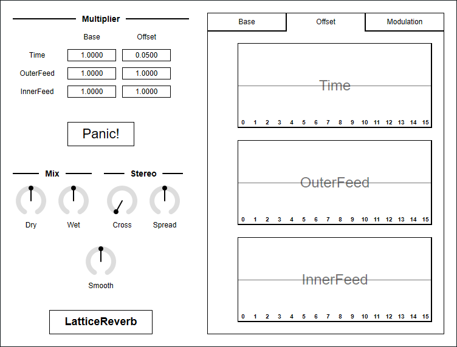

---
lang: ja
...

# LatticeReverb


<ruby>LatticeReverb<rt>ラティス リバーブ</rt></ruby> はオールパスフィルタを格子状につないで入れ子にしたリバーブです。ディレイを使った高次のオールパスフィルタを使っています。

- [LatticeReverb 0.1.0 をダウンロード - VST® 3 (github.com)](https://github.com/ryukau/VSTPlugins/releases/download/LatticeReverb0.1.0/LatticeReverb0.1.2.zip) 
- [プリセットをダウンロード (github.com)](https://github.com/ryukau/VSTPlugins/releases/download/LatticeReverb0.1.0/LatticeReverbPresets.zip)

LatticeReverb の利用には AVX 以降の SIMD 命令セットをサポートする CPU が必要です。

パッケージには次のビルドが含まれています。

- Windows 64bit
- Linux 64bit
- macOS 64bit

Mac を持っていないので、 macOS ビルドはテストできていません。もしバグを見つけたときは [GitHub のリポジトリ](https://github.com/ryukau/VSTPlugins)に issue を作るか、 `ryukau@gmail.com` までメールを送っていただければ対応します。

Linux ビルドは Ubuntu 18.0.4 でビルドしています。また Bitwig 3.1.2 と REAPER 6.03 で動作確認を行いました。 Bitwig 3.1.2 では GUI が真っ黒になるバグがあるようです。

## インストール
### プラグイン
名前が `.vst3` で終わるディレクトリを OS ごとに決められた位置に配置してください。

- Windows では `/Program Files/Common Files/VST3/` に配置します。
- Linux では `$HOME/.vst3/` に配置します。
- macOS では `/Users/$USERNAME/Library/Audio/Plug-ins/VST3/` に配置します。

DAW によっては上記とは別に VST3 をインストールできるディレクトリを提供していることがあります。詳しくは利用している DAW のマニュアルを参照してください。

### プリセット
解凍して出てきたディレクトリを OS ごとに決められた位置に配置すると使えるようになります。

- Windows : `/Users/$USERNAME/Documents/VST3 Presets/Uhhyou`
- Linux : `$HOME/.vst3/presets/Uhhyou`
- macOS : `/Users/$USERNAME/Library/Audio/Presets/Uhhyou`

プリセットディレクトリの名前はプラグインと同じである必要があります。 `Uhhyou` ディレクトリが無いときは作成してください。

### Windows
プラグインが DAW に認識されないときは C++ redistributable をインストールしてみてください。インストーラは次のリンクからダウンロードできます。ファイル名は `vc_redist.x64.exe` です。

- [The latest supported Visual C++ downloads](https://support.microsoft.com/en-us/help/2977003/the-latest-supported-visual-c-downloads)

### Linux
Ubuntu 18.0.4 では次のパッケージのインストールが必要です。

```bash
sudo apt install libxcb-cursor0  libxkbcommon-x11-0
```

もし DAW がプラグインを認識しないときは、下のリンクの `Package Requirements` を参考にして VST3 に必要なパッケージがすべてインストールされているか確認してみてください。

- [VST 3 Interfaces: Setup Linux for building VST 3 Plug-ins](https://steinbergmedia.github.io/vst3_doc/vstinterfaces/linuxSetup.html)

REAPER の Linux 版がプラグインを認識しないときは `~/.config/REAPER/reaper-vstplugins64.ini` を削除して REAPER を再起動してみてください。

## 操作
つまみとスライダーでは次の操作ができます。

- <kbd>Ctrl</kbd> + <kbd>左クリック</kbd> : 値のリセット。
- <kbd>Shift</kbd> + <kbd>左ドラッグ</kbd> : 細かい値の変更。

数値スライダーでは、上記に加えて次の操作ができます。

- <kbd>ホイールクリック</kbd> : 最小値、中央値、最大値の切り替え。

青い縦棒が並んだコントロール (BarBox) ではショートカットが使えます。ショートカットは BarBox を左クリックしてフォーカスすると有効になります。フォーカス後にマウスカーソルを BarBox の領域外に移動させると、ショートカットが一時的に無効になります。ショートカットによって変更されるパラメータはカーソルの位置によって変更できます。

左下のプラグイン名をクリックすると、よく使いそうな一部のショートカットを見ることができます。利用できる全てのショートカットを次の表に掲載しています。

| 入力                                    | 操作                                       |
| :-------------------------------------- | :----------------------------------------- |
| <kbd>Ctrl</kbd> + <kbd>Left Click</kbd> | デフォルト値にリセット                     |
| <kbd>Mouse Middle Drag</kbd>            | 直線の描画                                 |
| <kbd>d</kbd>                            | すべての値をデフォルト値にリセット         |
| <kbd>D</kbd>                            | 最小値・中央値・最大値の切り替え           |
| <kbd>e</kbd>                            | 低域の強調                                 |
| <kbd>E</kbd>                            | 高域の強調                                 |
| <kbd>f</kbd>                            | ローパスフィルタ                           |
| <kbd>F</kbd>                            | ハイパスフィルタ                           |
| <kbd>i</kbd>                            | 値の反転 (最小値を保存)                    |
| <kbd>I</kbd>                            | 値の反転 (最小値を 0 に設定)               |
| <kbd>n</kbd>                            | 最大値を 1 に正規化 (最小値もスケーリング) |
| <kbd>N</kbd>                            | 最大値を 1 に正規化 (最小値を 0 に設定)    |
| <kbd>p</kbd>                            | ランダムに並べ替え                         |
| <kbd>r</kbd>                            | ランダマイズ                               |
| <kbd>R</kbd>                            | まばらなランダマイズ                       |
| <kbd>s</kbd>                            | 降順にソート                               |
| <kbd>S</kbd>                            | 昇順にソート                               |
| <kbd>t</kbd>                            | 少しだけランダマイズ                       |
| <kbd>,</kbd> (Comma)                    | 左に回転                                   |
| <kbd>.</kbd> (Period)                   | 右に回転                                   |
| <kbd>1</kbd>                            | すべての値を低減                           |
| <kbd>2</kbd>-<kbd>9</kbd>               | インデックスが 2n-9n の値を低減            |

操作できる箇所を右クリックすると DAW によって提供されているコンテキストメニューを開くことができます。

## 注意
サンプリング周波数によって出力が変わります。

次の手順に沿った操作が行われると出力が大きくなることがあります。

1. `OuterFeed` あるいは `InnerFeed` のいくつかを最大値あるいは最小値の近くに設定。
2. 信号を入力。
3. 手順 1. で設定した `OuterFeed` あるいは `InnerFeed` の値を変更する。

## ブロック線図
図が小さいときはブラウザのショートカット <kbd>Ctrl</kbd> + <kbd>マウスホイール</kbd> や、右クリックから「画像だけを表示」などで拡大できます。

図で示されているのは大まかな信号の流れです。実装と厳密に対応しているわけではないので注意してください。


## パラメータ
`Base` は左右のチャンネルで両方で使われる値です。 `Base` によってリバーブの大まかな質感が決まります。

`Offset` は左右のチャンネルの値の比率です。 `Offset` によって左右の広がりを作ることができます。

```
if (Offset >= 0) {
  valueL = Base
  valueR = Base * (1 - Offset)
}
else {
  valueL = Base * (1 + Offset)
  valueR = Base
}
```

Time

:   オールパスフィルタのディレイ時間です。

OuterFeed

:   格子構造のフィードバック、フィードフォワードの値です。

InnerFeed

:   格子構造の内側に入れ子になったオールパスフィルタのフィードバック、フィードフォワードの値です。

### Multiplier
`Time` 、 `OuterFeed` 、 `InnerFeed` の値をまとめて変更する係数です。リバーブの質感を変えずに減衰時間を変えるときに使えます。

### Panic!
ボタンを押すと `Time` 、 `OuterFeed` 、 `InnerFeed` の Multiplier を 0 にしてリバーブの出力を止めます。

出力が想定外に大きくなったときなど、音を手早く止めたいときに使えます。

### Mix
Dry

:   バイパスされる入力信号の音量です。

Wet

:   リバーブを通った信号の音量です。

### Stereo
Cross

:   格子の偶数段で左右のチャンネルの信号をミックスする割合です。

    0 のときはもう片方のチャンネルからの信号はミックスされません。 0.5 のときは現在のチャンネルともう片方のチャンネルの信号比が 1:1 になります。

Spread

:   ミッドとサイド (M-S) の信号の比率です。

    ミッドとサイドの信号は次の式で計算されます。

    ```
mid  = left + right
side = left - right

left  = mid - Spread * (mid - side)
right = mid - Spread * (mid + side)
    ```

### Misc.
Smooth

:   パラメータを変更したときに、変更前の値から変更後の値へと移行する大まかな秒数です。

### Base


`Time` 、 `OuterFeed` 、 `InnerFeed` の左右のチャンネルで共通する値を設定するタブです。

リバーブの大まかなキャラクタは Base タブの設定で決まります。

### Offset


`Time` 、 `OuterFeed` 、 `InnerFeed` の左右のチャンネル間での差を設定するタブです。

Offset タブの値を変えると左右の広がりが出ます。

### Modulation


Time LFO

:   LFO によって `Time` を変調する量です。

    LFO の波形はノイズ（一様乱数）です。 `Time LFO Cutoff` と `Smooth` の値によって滑らかさが変わります。

Time LFO Cutoff

:   LFO にかけるローパスフィルタのカットオフ周波数です。

Lowpass Cutoff

:   格子の各段に備えられたローパスフィルタのカットオフ周波数です。

    リバーブの明るさを変更するときに役立ちます。

## チェンジログ
- 0.1.0
  - 初期リリース。

### 旧バージョン
現在、旧バージョンはありません。

## ライセンス
LatticeReverb のライセンスは GPLv3 です。 GPLv3 の詳細と、利用したライブラリのライセンスは次のリンクにまとめています。

- [https://github.com/ryukau/VSTPlugins/tree/master/License](https://github.com/ryukau/VSTPlugins/tree/master/License)

リンクが切れているときは `ryukau@gmail.com` にメールを送ってください。

### VST® について
VST is a trademark of Steinberg Media Technologies GmbH, registered in Europe and other countries.
