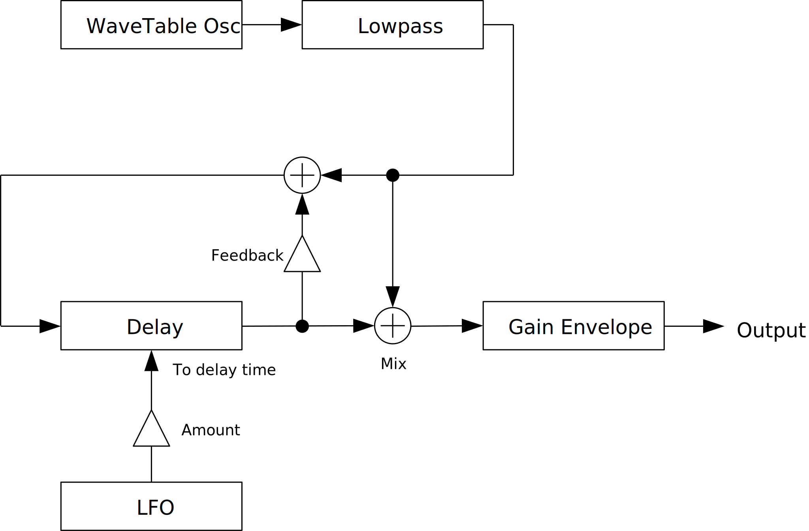
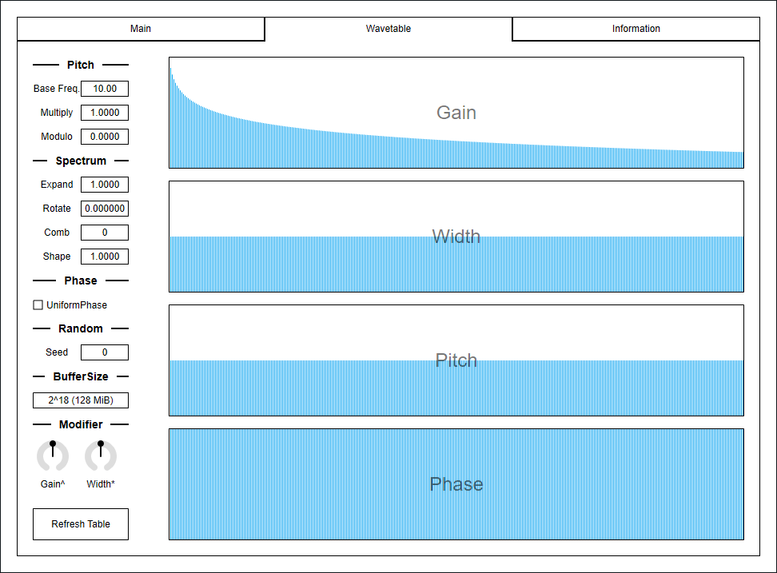
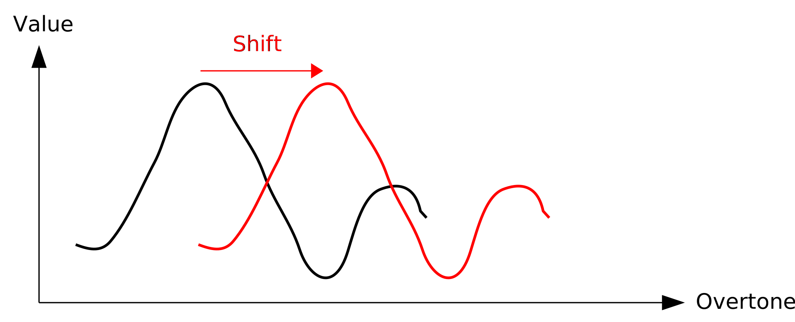

---
lang: ja
...

# LightPadSynth


<ruby>LightPadSynth<rt>ライト パッド シンセ</rt></ruby> はピッチ変調を無くして補間を線形補完に変えた CubicPadSynth の軽量版です。ピッチ変調ができなくなった代わりに、各ボイスにディレイを追加しています。

- [LightPadSynth 0.1.6 をダウンロード - VST® 3 (github.com)](https://github.com/ryukau/VSTPlugins/releases/download/L3Reverb0.1.0/LightPadSynth0.1.6.zip) 
- [プリセットをダウンロード (github.com)](https://github.com/ryukau/VSTPlugins/releases/download/LightPadSynth0.1.0/LightPadSynthPresets.zip)

LightPadSynth を使うには CPU が AVX 以降の SIMD 命令セットをサポートしている必要があります。

パッケージには次のビルドが含まれています。

- Windows 64bit
- Linux 64bit
- macOS 64bit

Mac を持っていないので、 macOS ビルドはテストできていません。もしバグを見つけたときは [GitHub のリポジトリ](https://github.com/ryukau/VSTPlugins)に issue を作るか、 `ryukau@gmail.com` までメールを送っていただければ対応します。

Linux ビルドは Ubuntu 18.0.4 でビルドしています。また REAPER 6.03 で動作確認を行いました。 Bitwig 3.1.2 では GUI が真っ黒になるバグがあるようです。

## インストール
### プラグイン
名前が `.vst3` で終わるディレクトリを OS ごとに決められた位置に配置してください。

- Windows では `/Program Files/Common Files/VST3/` に配置します。
- Linux では `$HOME/.vst3/` に配置します。
- macOS では `/Users/$USERNAME/Library/Audio/Plug-ins/VST3/` に配置します。

DAW によっては上記とは別に VST3 をインストールできるディレクトリを提供していることがあります。詳しくは利用している DAW のマニュアルを参照してください。

### プリセット
解凍して出てきたディレクトリを OS ごとに決められた位置に配置すると使えるようになります。

- Windows : `/Users/$USERNAME/Documents/VST3 Presets/Uhhyou`
- Linux : `$HOME/.vst3/presets/Uhhyou`
- macOS : `/Users/$USERNAME/Library/Audio/Presets/Uhhyou`

プリセットディレクトリの名前はプラグインと同じである必要があります。 `Uhhyou` ディレクトリが無いときは作成してください。

### Windows
プラグインが DAW に認識されないときは C++ redistributable をインストールしてみてください。インストーラは次のリンクからダウンロードできます。ファイル名は `vc_redist.x64.exe` です。

- [The latest supported Visual C++ downloads](https://support.microsoft.com/en-us/help/2977003/the-latest-supported-visual-c-downloads)

### Linux
Ubuntu 18.0.4 では次のパッケージのインストールが必要です。

```bash
sudo apt install libxcb-cursor0  libxkbcommon-x11-0
```

もし DAW がプラグインを認識しないときは、下のリンクの `Package Requirements` を参考にして VST3 に必要なパッケージがすべてインストールされているか確認してみてください。

- [VST 3 Interfaces: Setup Linux for building VST 3 Plug-ins](https://steinbergmedia.github.io/vst3_doc/vstinterfaces/linuxSetup.html)

REAPER の Linux 版がプラグインを認識しないときは `~/.config/REAPER/reaper-vstplugins64.ini` を削除して REAPER を再起動してみてください。

## 色の設定
初回設定時は手動で次のファイルを作成してください。

- Windows では `/Users/ユーザ名/AppData/Roaming/UhhyouPlugins/style/style.json` 。
- Linux では `$XDG_CONFIG_HOME/UhhyouPlugins/style/style.json` 。
  - `$XDG_CONFIG_HOME` が空のときは `$HOME/.config/UhhyouPlugins/style/style.json` 。
- macOS では `/Users/$USERNAME/Library/Preferences/UhhyouPlugins/style/style.json` 。

既存の色のテーマを次のリンクに掲載しています。 `style.json` にコピペして使ってください。

- [LV2Plugins/style/themes at master · ryukau/LV2Plugins · GitHub](https://github.com/ryukau/LV2Plugins/tree/master/style/themes)

`style.json` の設定例です。

```json
{
  "fontPath": "",
  "foreground": "#ffffff",
  "foregroundButtonOn": "#000000",
  "foregroundInactive": "#8a8a8a",
  "background": "#353d3e",
  "boxBackground": "#000000",
  "border": "#808080",
  "borderCheckbox": "#808080",
  "unfocused": "#b8a65c",
  "highlightMain": "#368a94",
  "highlightAccent": "#2c8a58",
  "highlightButton": "#a77842",
  "highlightWarning": "#8742a7",
  "overlay": "#ffffff88",
  "overlayHighlight": "#00ff0033"
}
```

16 進数カラーコードを使っています。

- 6 桁の色は RGB 。
- 8 桁の色は RGBA 。

プラグインはカラーコードの 1 文字目を無視します。よって `?102938` や `\n11335577` も有効なカラーコードです。

2 文字目以降のカラーコードの値に `0-9a-f` 以外の文字を使わないでください。

以下は設定できる色の一覧です。設定に抜けがあるとデフォルトの色が使われます。

- `fontPath`: フォント (*.ttf) の絶対パス。VST 3 版では実装されていません。
- `foreground`: 文字の色。
- `foregroundButtonOn`: オンになっているボタンの文字の色。 `foreground` か `boxBackground` のいずれかと同じ値にすることを推奨します。
- `foregroundInactive`: 非アクティブなタブの文字の色。
- `background`: 背景色。x
- `boxBackground`: 矩形の UI 部品の内側の背景色。
- `border`: <ruby>縁<rt>ふち</rt></ruby>の色。
- `borderCheckbox`: チェックボックスの縁の色。
- `unfocused`: つまみがフォーカスされていないときの色。
- `highlightMain`: フォーカスされたときの色。スライダの値の表示にも使用されます。
- `highlightAccent`: フォーカスされたときの色。一部のプラグインをカラフルにするために使用されます。
- `highlightButton`: ボタンがフォーカスされたときの色。
- `highlightWarning`: 変更に注意を要する UI がフォーカスされたときの色。
- `overlay`: オーバーレイの色。
- `overlayHighlight`: フォーカスを示すオーバーレイの色。

## 操作
操作できる箇所を右クリックすると DAW によって提供されているコンテキストメニューを開くことができます。

つまみとスライダーでは次の操作ができます。

- Ctrl + 左クリック : 値のリセット。
- Shift + 左ドラッグ : 細かい値の変更。

`Octave` 、 `Seed` などで使われている数値スライダーでは、上記に加えて次の操作ができます。

- ホイールクリック : 最小値、最大値の切り替え。

Wavetable タブの `Gain`, `Width`, `Pitch`, `Phase` と Main タブの `LFO Wave` で使われている青い縦棒が並んだコントロール (BarBox) ではショートカットが使えます。ショートカットは BarBox を左クリックしてフォーカスすると有効になります。フォーカス後にマウスカーソルを BarBox の領域外に移動させると、ショートカットが一時的に無効になります。ショートカットによって変更されるパラメータはカーソルの位置によって変更できます。 Information タブを開くとショートカットの一覧を見ることができます。

| 入力                                     | 操作                                    |
| ---------------------------------------- | --------------------------------------- |
| <kbd>Ctrl</kbd> + <kbd>左ドラッグ</kbd>  | デフォルト値にリセット                  |
| <kbd>Shift</kbd> + <kbd>左ドラッグ</kbd> | 素朴な描画 (フレーム間の補間が無効)     |
| <kbd>ホイールドラッグ</kbd>              | 直線の描画                              |
| <kbd>a</kbd>                             | 符号を交互に入れ替え                    |
| <kbd>d</kbd>                             | すべての値をデフォルト値にリセット      |
| <kbd>D</kbd>                             | 最小値・中央値・最大値の切り替え        |
| <kbd>e</kbd>                             | 低域の強調                              |
| <kbd>E</kbd>                             | 高域の強調                              |
| <kbd>f</kbd>                             | ローパスフィルタ                        |
| <kbd>F</kbd>                             | ハイパスフィルタ                        |
| <kbd>i</kbd>                             | 値の反転 (最小値を保存)                 |
| <kbd>I</kbd>                             | 値の反転 (最小値を 0 に設定)            |
| <kbd>n</kbd>                             | 最大値を 1 に正規化 (最小値を保存)      |
| <kbd>N</kbd>                             | 最大値を 1 に正規化 (最小値を 0 に設定) |
| <kbd>p</kbd>                             | ランダムに並べ替え                      |
| <kbd>r</kbd>                             | ランダマイズ                            |
| <kbd>R</kbd>                             | まばらなランダマイズ                    |
| <kbd>s</kbd>                             | 降順にソート                            |
| <kbd>S</kbd>                             | 昇順にソート                            |
| <kbd>t</kbd>                             | 少しだけランダマイズ (ランダムウォーク) |
| <kbd>T</kbd>                             | 少しだけランダマイズ (0 に収束)         |
| <kbd>z</kbd>                             | アンドゥ                                |
| <kbd>Z</kbd>                             | リドゥ                                  |
| <kbd>,</kbd> (Comma)                     | 左に回転                                |
| <kbd>.</kbd> (Period)                    | 右に回転                                |
| <kbd>1</kbd>                             | すべての値を低減                        |
| <kbd>2</kbd>-<kbd>9</kbd>                | インデックスが 2n-9n の値を低減         |

いくつかの BarBox の下にはスクロールバーがついています。細かい調整を行うときはスクロールバーの左右のハンドルを <kbd>左ドラッグ</kbd> で動かすことで表示範囲を変更できます。スクロールバーでは次の操作が行えます。

- <kbd>右クリック</kbd> : 表示範囲のリセット
- <kbd>マウスホイール</kbd> : ズームイン・ズームアウト

## 注意
`Refresh LFO` あるいは `Refresh Table` ボタンを押すと音が止まります。発音中のノートも全て停止します。

## ウェーブテーブルの仕様
各 MIDI ノートに対応する 128 の帯域制限されたウェーブテーブルが生成されます。 128 という数字は MIDI ノート番号の値の範囲から来ています。

チューニングがずれているときは、セント値を切り捨てたインデックスのウェーブテーブルが使われます。例えば MIDI ノート番号が 60 、チューニングが -20 セントのときは `floor(60 - 0.20)` よりインデックス 59 のウェーブテーブルが使われます。

言い換えれば、チューニングがずれているときはナイキスト周波数より少し低い周波数で帯域制限されることがあります。

## ブロック線図
図が小さいときはブラウザのショートカット <kbd>Ctrl</kbd> + <kbd>マウスホイール</kbd> や、右クリックから「画像だけを表示」などで拡大できます。

図で示されているのは大まかな信号の流れです。実装と厳密に対応しているわけではないので注意してください。



## パラメータ
### Main タブ


#### Gain
A, D, S, R

:   音量エンベロープのパラメータです。

    - `A` (Attack) : 鍵盤を押した瞬間から最大音量になるまでのアタック時間。
    - `D` (Decay) : 最大音量からサステイン音量になるまでのディケイ時間。
    - `S` (Sustain) : アタックとディケイが終わった後に鍵盤を押し続けているときのサステイン音量。
    - `R` (Release) : 鍵盤から指を離したあとに音量が 0 になるまでのリリース時間。

Gain

:   音量を変更します。

#### Lowpass
素朴な 3-pole ローパスフィルタです。

Cutoff

:   フィルタのカットオフ周波数です。

Resonance

:   フィルタのレゾナンスです。最大にすると音量が大きくなるので注意してください。

KeyFollow

:   右いっぱいに回すと、カットオフ周波数がノートの音程と同じになります。左いっぱいに回すと音程に関わらず `Cutoff` で設定されたカットオフ周波数を使います。

A, D, S, R, Amount

:   フィルタのカットオフ周波数を変調するエンベロープのパラメータです。 `Amount` は `Cutoff` への変調量です。

#### Tuning
Octave, Semi, Milli

:   全体の音の高さを変更します。

    - `Octave`: オクターブ
    - `Semi`: 半音
    - `Milli`: 半音の 1 / 1000 。 1 / 10 セント。

ET, A4 [Hz]

:   音律を変更します。

    `ET` は Equal Temperature (平均律) の略です。 `ET` が 12 のときは 12 平均律となります。 `ET` を 12 よりも小さくすると無音になる範囲が増えるので注意してください。

    `A4 [Hz]` は、音程 A4 の周波数です。

#### Unison
nUnison

:   ユニゾンに使うボイスの数です。

    `Misc.` の `nVoice` を増やすことで `nUnison` が大きいときに起こるリリースの途切れを減らすことができますが、引き換えに動作が重くなります。

Detune, Random Detune

:   `Detune` はユニゾンに使われているボイスのピッチをずらす量です。

    `Random Detune` のチェックを入れると、ピッチがずれる量がノートオンごとにランダムに変わるようになります。

    ```
    random = RandomDetune ? rand() : 1
    detune = pitch * (1 + random * unisonIndex * Detune)
    ```

GainRnd

:   ユニゾンに使われているボイスの音量をランダムに変更する量です。

Phase

:   ユニゾンに使われているボイスの位相をランダムに変更する量です。

    Phase セクションの `Reset` にチェックが入っていないとき、この値は無視されます。

Spread, Spread Type

:   `Spread` はユニゾンの左右の広がりの量です。

    `Spread Type` でボイスのピッチに応じたパンの割り当て方を選択できます。

    - `Alternate L-R`: `Ascend L -> R` と `Ascend R -> L` を交互に変更。
    - `Alternate M-S`: `HighOnMid` と `HighOnSide` を交互に変更。
    - `Ascend L -> R`: 左から右に向かってピッチが上昇。
    - `Ascend R -> L`: 右から左に向かってピッチが上昇。
    - `HighOnMid`: 端から中央に向かってピッチが上昇。
    - `HighOnSide`: 中央から端に向かってピッチが上昇。
    - `Random`: ランダムに生成したパンを割り当て。偏ることがあります。
    - `RotateL`: ノートオンごとに割り当てを左に回転。
    - `RotateR`: ノートオンごとに割り当てを右に回転。
    - `Shuffle`: 均一に並べたパンをランダムに割り当て。

#### Phase
Phase

:   オシレータの初期位相です。

Reset

:   チェックを入れると、ノートオンのたびにオシレータの位相を `Phase` で指定した値にリセットします。

Random

:   チェックを入れると、ノートオンごとに位相をランダマイズします。 `Phase` で指定した値がランダマイズの範囲になります。

#### Misc.
Smooth

:   特定の値を変更したときに、変更前の値から変更後の値に移行する時間（秒）です。

    `Smooth` と関連するパラメータのリストです。 `*` はワイルドカードです。

    - Tuning セクションの全て
    - Gain
      - `Gain`
      - `S`
    - Lowpass
      - `Cutoff`
      - `S`
      - `Amount`
      - `KeyFollow`
    - Delay
      - `Mix`
      - `Feedback`
      - `Attack`
      - `Semi`
      - `Milli`
    - Delay LFO
      - `Tempo`
      - `Multiply`
      - `Amount`
      - `Lowpass`
    - Phase
      - `Phase`

Poly

:   最大同時発音数です。値を小さくすると CPU 消費が減ります。

Seed

:   乱数のシード値です。この値を変えると生成される乱数が変わります。

    `Main` タブと `Wavetable` タブでは異なる乱数列が使われています。

#### Delay
Mix

:   フィルタ出力とディレイ出力を混ぜる比率です。

Feedback

:   ディレイのフィードバックです。右に回すと正のフィードバック、左に回すと負のフィードバックがかかります。

Attack

:   フィルタからの出力をディレイに入力するときに掛け合わされるゲートのアタック時間です。

Semi, Milli

:   ノートの周波数から相対的に決められるディレイ時間です。次の式で計算されます。

    ```
    delayTime = 1 / (noteFreq * pow(2, (semi + 0.001 * milli) / 12))
    ```

#### LFO
Tempo, Multiply

:   LFO の周波数をテンポに応じた形で指定します。 `Tempo` の下の数字が音符の長さ、上の数字が音符の数です。例えば上が 6 、下が 8 なら 8 分音符の 6 個分の長さが LFO の 1 周期になります (6 / 8 拍子)。

    `Multiply` は `Tempo` から計算された周波数に掛け合わされる値です。

    ```
    // (60 秒) * (4 拍子) = 240 。
    lfoFrequency = Multiply * (BPM / 240) / (TempoUpperNumeral / TempoLowerNumeral)
    ```

Amount

:   LFO でピッチを変調する量です。

Lowpass

:   LFO にかけるローパスフィルタのカットオフ周波数を変更します。

Interpolation

:   LFO のウェーブテーブルの補間の種類です。

    

Refresh LFO

:   現在の `LFO Wave` のパラメータに基づいて LFO のウェーブテーブルを更新します。

    ウェーブテーブルの更新中は音が止まるので注意してください。発音中のノートも全て停止します。

LFO Wave

:   LFO の波形です。

### Wavetable タブ


#### 倍音コントロール
Gain

:   プロファイルの高さです。

Width

:   プロファイルの幅です。

Pitch

:   プロファイルの周波数にかけ合わせる値です。

Phase

:   プロファイルの位相をランダマイズする量です。

#### Pitch
Base Freq.

:   ウェーブテーブルのレンダリング時の基本周波数です。この値が小さいとマスターピッチのチューニングが狂うことがあるので注意してください。

Multiply, Modulo

:   プロファイルの周波数を変更します。

    ```
    profileFrequency = mod(
      BaseFreq * profileIndex * overtonePitch * Multiply,
      440 * pow(2, (Modulo - 69) / 12)
    )
    ```

#### Spectrum
Expand

:   スペクトラムを周波数軸に沿って拡大・縮小するスケーリング係数です。

    

Shift

:   スペクトラムを左右にシフトする量です。

    

Comb

:   `Comb` の値が 1 以上のとき、プロファイルをくし状に変形します。値はくしのすき間の間隔です。

    

Shape

:   `Shape` の値を指数として、プロファイルの形をべき乗によって変更します。

    ```
    shapedProfile = powf(profile, shape);
    ```

#### Phase
UniformPhase

:   チェックを入れると、プロファイル内での位相を均一にします。

#### Random
Seed

:   乱数のシード値です。この値を変えると生成される乱数が変わります。

    `Main` タブと `Wavetable` タブでは異なる乱数列が使われています。

#### BufferSize
1 つのウェーブテーブルの大きさです。 `2^10` から `2^21` の範囲の 2 のべき乗の値を選択できます。

`()` で表示された値は全てのウェーブテーブルを合わせたバイト数です。バイト数は次の式で計算できます。

```
bytes = 4 * 128 * BufferSize
```

#### Modifier
Gain^

:   倍音コントロールの `Gain` をべき乗する値です。

    ```
    profileGain = pow(Gain, Gain^)
    ```

Width\*

:   倍音コントロールの `Width` にかけ合わせる値です。

    ```
    profileWidth = Width * (Width*)
    ```

#### Refresh Table
現在の Wavetable タブのパラメータに基づいてオシレータのウェーブテーブルを更新します。

ウェーブテーブルの更新中は音が止まるので注意してください。発音中のノートも全て停止します。

## チェンジログ
- 0.1.6
  - DSP が初期化されているかどうかのチェックを追加。
- 0.1.5
  - いくつかの BarBox にスクロールバーを追加。
  - BarBox に アンドゥ・リドゥの機能を追加。
- 0.1.4
  - カラーコンフィグを追加。
- 0.1.3
  - パラメータの補間を可変サイズのオーディオバッファでも機能する以前の手法に巻き戻した。
- 0.1.2
  - 起動時にパラメータがロードされる前にウェーブテーブルが更新されるバグを修正。
  - LFO ウェーブテーブルの補間が Cubic のときにインデックスが 1 つずれていたバグを修正。
- 0.1.1
  - Refresh LFO ボタンと Refresh Table ボタンをメッセージからパラメータに修正。
- 0.1.0
  - 初期リリース。

### 旧バージョン
- [LightPadSynth 0.1.5 - VST 3 (github.com)](https://github.com/ryukau/VSTPlugins/releases/download/L4Reverb0.1.0/LightPadSynth0.1.5.zip)
- [LightPadSynth 0.1.4 - VST 3 (github.com)](https://github.com/ryukau/VSTPlugins/releases/download/ColorConfig/LightPadSynth0.1.4.zip)
- [LightPadSynth 0.1.3 - VST 3 (github.com)](https://github.com/ryukau/VSTPlugins/releases/download/LatticeReverb0.1.0/LightPadSynth0.1.3.zip)
- [LightPadSynth 0.1.2 - VST 3 (github.com)](https://github.com/ryukau/VSTPlugins/releases/download/WavetableInitializationBugFix/LightPadSynth0.1.2.zip)
- [LightPadSynth 0.1.0 - VST 3 (github.com)](https://github.com/ryukau/VSTPlugins/releases/download/LightPadSynth0.1.0/LightPadSynth0.1.0.zip)

## ライセンス
LightPadSynth のライセンスは GPLv3 です。 GPLv3 の詳細と、利用したライブラリのライセンスは次のリンクにまとめています。リンクが切れているときは `ryukau@gmail.com` にメールを送ってください。

- [https://github.com/ryukau/VSTPlugins/tree/master/License](https://github.com/ryukau/VSTPlugins/tree/master/License)

### VST® について
VST is a trademark of Steinberg Media Technologies GmbH, registered in Europe and other countries.
